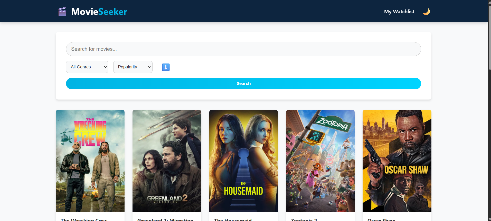
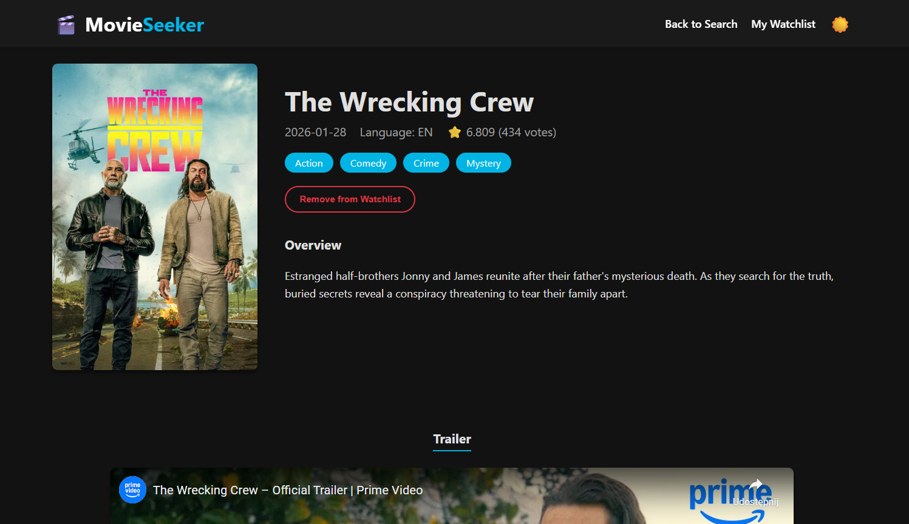
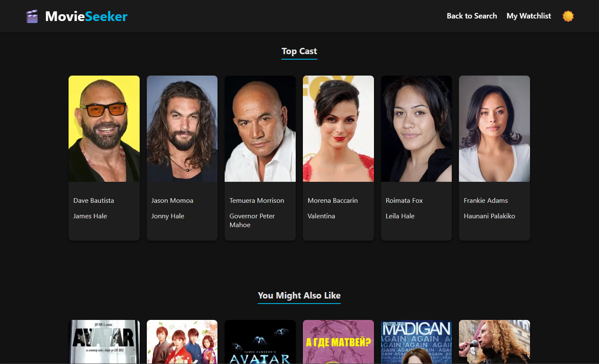
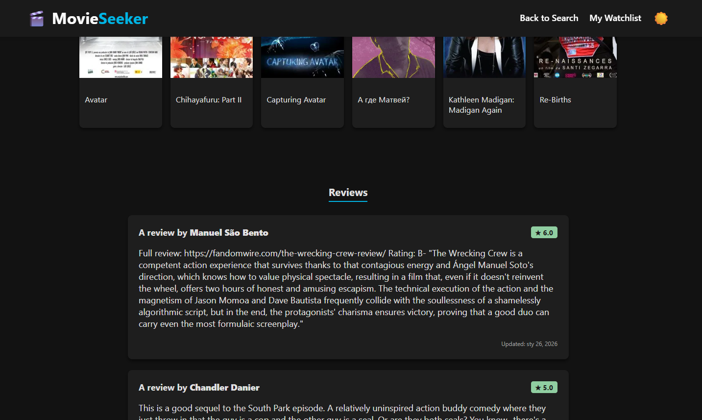
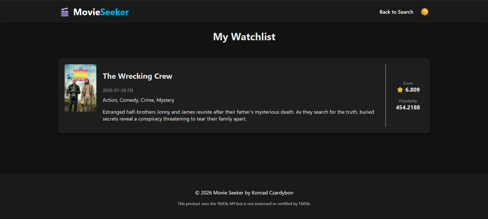

# 🎬 MovieSeeker

Movie Seeker is a dynamic web application built with Java Servlets and JSP that allows users to explore movies, view detailed information, watch trailers, and manage a personal watchlist. It interacts seamlessly with The Movie Database (TMDb) API.

## Table of Contents
- [Features](#sparkles-features)
- [Technologies Used](#hammer_and_wrench-technologies-used)
- [Code Structure](#file_folder-code-structure)
- [Visual Examples](#movie_camera-visual-examples-leftwards_arrow_with_hook)
- [Setup Instructions](#gear-setup-instructions)
- [Configuration](#key-configuration)
- [Docker Support](#whale-docker-support)
- [License](#scroll-license)

## :sparkles: Features

### Discovery & Search
- **Live Search Suggestions:** Real-time movie suggestions as you type in the search bar.
- **Advanced Filtering:** Filter movies by specific genres (Action, Comedy, Drama, etc.).
- **Sorting Options:** Sort results by Popularity, Release Date, Rating, or Vote Count in both Ascending and Descending order.
- **Pagination:** Navigate through thousands of movie results with built-in pagination.

### Movie Details
- **Comprehensive Info:** View overview, release date, runtime, language, and rating.
- **Trailers:** Watch YouTube trailers directly within the application.
- **Cast & Crew:** Scrollable list of top cast members with photos.
- **Reviews:** Read user reviews fetched from TMDb.
- **Recommendations:** Get a list of similar movies you might like.

### User Experience
- **Watchlist:** Save your favorite movies to a local watchlist (persisted via LocalStorage) to watch later.
- **Dark/Light Theme:** Toggle between dark and light modes with a persistent preference setting.
- **Responsive Design:** Optimized for both desktop and mobile viewing.

## :hammer_and_wrench: Technologies Used [:leftwards_arrow_with_hook:](#table-of-contents)
- **Backend:** Java 17, Jakarta Servlet API 6.0
- **Frontend:** JSP (JavaServer Pages), JSTL, CSS3, Vanilla JavaScript
- **Data Handling:** Google Gson (JSON parsing)
- **Build Tool:** Maven
- **Server:** Apache Tomcat 11.0
- **API:** The Movie Database (TMDb) API

## :file_folder: Code Structure [:leftwards_arrow_with_hook:](#table-of-contents)
- **`src/main/java`**
    - **`model`**: POJOs representing `Movie`, `Actor`, `Review`, and `SearchResult`.
    - **`service`**: `MovieService.java` handles all HTTP requests to the TMDb API and parses JSON responses.
    - **`servlet`**:
        - `MovieSearchServlet`: Handles main page rendering, searching, filtering, and pagination logic.
        - `MovieDetailsServlet`: Fetches and displays data for a single movie.
        - `MovieSuggestionsServlet`: Provides JSON data for the live search dropdown.
        - `WatchlistServlet`: Processes multiple movie IDs to render the user's watchlist.
    - **`util`**: `AppConfig.java` manages secure API key retrieval.
- **`src/main/webapp`**
    - **`js`**: `watchlist.js` (LocalStorage logic), `theme.js` (Dark mode), `suggestions.js` (AJAX search).
    - **`css`**: Custom styling with CSS variables for theming.

## :movie_camera: Visual Examples [:leftwards_arrow_with_hook:](#table-of-contents)

<details>
  <summary>See Home Page</summary>
  <br>
  
  <br>
</details>
<details>
  <summary>See Movie Details Page (Details)</summary>
  <br>
  
  <br>
</details>
<details>
  <summary>See Movie Details Page (Cast)</summary>
  <br>
  
  <br>
</details>
<details>
  <summary>See Movie Details Page (Reviews)</summary>
  <br>
  
  <br>
</details>
<details>
  <summary>See Watchlist Page</summary>
  <br>
  
  <br>
</details>

## :gear: Setup Instructions [:leftwards_arrow_with_hook:](#table-of-contents)

### Prerequisites
- Java JDK 17 or higher
- Maven 3.8+
- A TMDb API Key (Get it from [The Movie Database](https://www.themoviedb.org/documentation/api))

### Local Installation

1. **Clone the repository:**
   ```bash
   git clone https://github.com/konradcz2001/movieseeker.git
   cd movieseeker
   ```

2. **Configure the API Key:**
   See the [Configuration](#key-configuration) section below for details on setting up `TMDB_API_KEY`.

3. **Build the project:**
   ```bash
   ./mvnw clean package
   ```

4. **Run with Tomcat:**
   Deploy the generated WAR file from the `target/` directory to your local Tomcat server or run via your IDE configuration.

5. **Access the app:**
   Open `http://localhost:8080` in your web browser.

## :key: Configuration [:leftwards_arrow_with_hook:](#table-of-contents)

The application uses `AppConfig.java` to securely load your TMDb API Key. You have two options:

### Option 1: Environment Variable (Recommended)
Set an environment variable on your system or server:
- **Variable Name:** `TMDB_API_KEY`
- **Value:** Your actual API key (e.g., `tmdb...` or the alphanumeric string).

### Option 2: Properties File
Create a file named `secrets.properties` in `src/main/resources/`.
> **Note:** This file is ignored by Git via `.gitignore` for security reasons.

Add your key inside the file:
```properties
tmdb.api.key=YOUR_ACTUAL_API_KEY_HERE
```

## :whale: Docker Support [:leftwards_arrow_with_hook:](#table-of-contents)

You can run the application easily using Docker and Docker Compose.

1. Ensure the `TMDB_API_KEY` environment variable is set in your terminal or added to the `docker-compose.yml`.
2. Run the following command:
   ```bash
   docker-compose up --build
   ```
3. The application will be available at `http://localhost:8080`.

## :scroll: License [:leftwards_arrow_with_hook:](#table-of-contents)

Distributed under the MIT License. See [LICENSE](LICENSE) for more information.

---
*Disclaimer: This product uses the TMDb API but is not endorsed or certified by TMDb.*