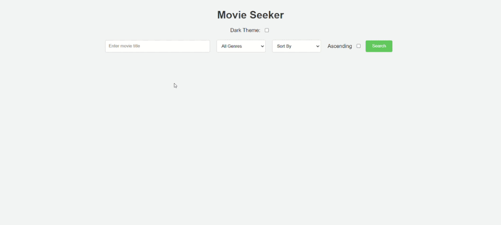
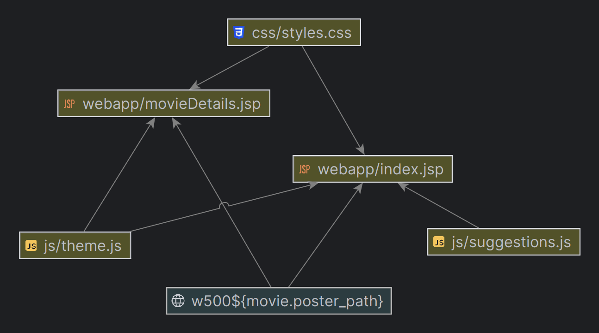
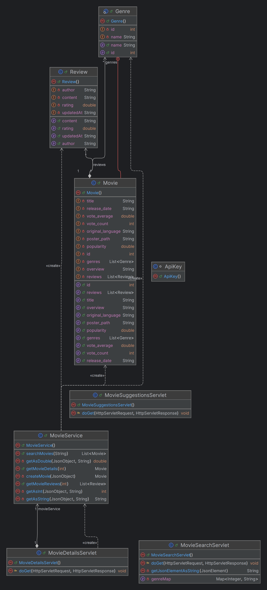

# Movie Seeker


## Table of Contents
- [Project Description](#page_facing_up-project-description)
- [Features](#sparkles-features)
- [Technologies Used](#hammer_and_wrench-technologies-used-leftwards_arrow_with_hook)
- [Hosting](#globe_with_meridians-hosting-leftwards_arrow_with_hook)
- [Code Structure](#file_folder-code-structure-leftwards_arrow_with_hook) 
- [API Endpoints](#books-api-endpoints-leftwards_arrow_with_hook)
- [Visual Examples](#movie_camera-visual-examples-leftwards_arrow_with_hook)
- [Class Diagrams](#bar_chart-class-diagrams-leftwards_arrow_with_hook)
- [Setup Instructions](#gear-setup-instructions-leftwards_arrow_with_hook)
- [Contributing](#handshake-contributing-leftwards_arrow_with_hook)
- [Acknowledgements](#pray-acknowledgements-leftwards_arrow_with_hook)


## :page_facing_up: Project Description
Movie Seeker is a web application that allows users to search for movies and read detailed information about them. It provides an easy-to-use interface for movie enthusiasts to find and explore movies.


## :sparkles: Features
- Searching for movies in the api provider's database.
- Sort results by popularity, release date, etc.
- Displaying movie details and its reviews.
- Dark theme support.


## :hammer_and_wrench: Technologies Used [:leftwards_arrow_with_hook:](#table-of-contents)
- Java
- JSP
- JavaScript
- Maven
- Tomcat


## :globe_with_meridians: Hosting [:leftwards_arrow_with_hook:](#table-of-contents)
The application is hosted and can be accessed at: https://movie-seeker-production.up.railway.app/


## :file_folder: Code Structure [:leftwards_arrow_with_hook:](#table-of-contents)
- **MovieService.java:** Contains methods to interact with the Movie Database API, including searching for movies, retrieving movie details, and fetching movie reviews.
- **MovieSuggestionsServlet.java:** Handles HTTP GET requests for movie suggestions based on a query parameter.
- **MovieDetailsServlet.java:** Handles HTTP GET requests to retrieve details of a specific movie based on the provided movie ID.
- **theme.js:** Manages the theme toggling functionality between dark mode and light mode.


## :books: API Endpoints [:leftwards_arrow_with_hook:](#table-of-contents)
The application interacts with the Movie Database API to fetch movie data. Below are the main endpoints used:

### Search Movies
- **Endpoint:** `/suggestions`
- **Method:** GET
- **Description:** Searches for movies based on the provided query string.
- **Parameters:**
    - `query` (string): The search query string to look for movies.
- **Example Request:**
    ```sh
    GET /suggestions?query=Inception
    ```

### Movie Details
- **Endpoint:** `/movieDetails`
- **Method:** GET
- **Description:** Retrieves details of a specific movie based on the provided movie ID.
- **Parameters:**
    - `id` (int): The unique identifier of the movie.
- **Example Request:**
    ```sh
    GET /movieDetails?id=12345
    ```


## :movie_camera: Visual Examples [:leftwards_arrow_with_hook:](#table-of-contents)

- [Movie searching](#movie-searching)
- [Dark theme presentation](#dark-theme-presentation-leftwards_arrow_with_hook)

### Movie searching


### Dark theme presentation [:leftwards_arrow_with_hook:](#movie_camera-visual-examples-leftwards_arrow_with_hook)



## :bar_chart: Class Diagrams [:leftwards_arrow_with_hook:](#table-of-contents)

### [JavaScript Module Dependencies](src/main)


### [Java Classes](src/main)



## :gear: Setup Instructions [:leftwards_arrow_with_hook:](#table-of-contents)
To run this project locally, follow these steps:

#### Prerequisites

- Java 17 or higher
- Maven

#### Installation

1. Clone the repository:
    ```sh
    git clone https://github.com/yourusername/movieseeker.git
    ```
2. Navigate to the project directory:
    ```sh
    cd movieseeker
    ```
3. Create an account and get your own API key in [The Movie Database (TMDb) API](https://www.themoviedb.org/) developer section.
<br><br>
4. Add ApiKey class to main package with your API key:
    ```bash
    package com.konrad.movieseeker;

    class ApiKey {
        static final String apiKey = "your API key";
    }

    ```
5. Build the project using your preferred IDE (e.g., IntelliJ IDEA).

#### Usage
1. Start the server.
2. Open your web browser and navigate to the hosted URL or `http://localhost:8080` if running locally.
3. Use the search bar to find movies and click on the movie titles to view detailed information.


## :handshake: Contributing [:leftwards_arrow_with_hook:](#table-of-contents)
Contributions are welcome! Please fork the repository and create a pull request with your changes. You can also contact me: konradcz2001@gmail.com


## :pray: Acknowledgements [:leftwards_arrow_with_hook:](#table-of-contents)
- [The Movie Database (TMDb) API](https://www.themoviedb.org/documentation/api) for providing movie data.
